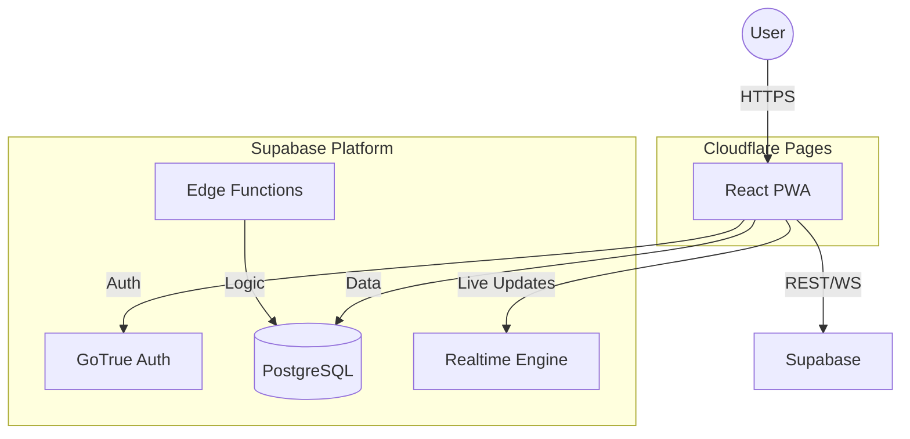

# DineIn Malta - Monorepo

> **Status**: Active Development 🚧  
> **Type**: AI-First Mobile PWA 📱  
> **Design System**: Soft Liquid Glass ✨

**DineIn** is a next-generation restaurant ordering and reservation platform built for Malta. It leverages an AI-first approach to deliver a "native-app-like" Progressive Web App (PWA) experience with a premium "Soft Liquid Glass" aesthetic.

---

## 📚 Documentation Hub

### 🚀 **App Development**
- **[Getting Started](CONTRIBUTING.md#getting-started)**: Setup guide for new developers.
- **[Contribution Guidelines](CONTRIBUTING.md)**: Git workflow, PR process, and coding standards.
- **[API Integration](docs/API_INTEGRATION.md)**: Hooks, data fetching, and error handling.
- **[Vendor Dashboard Guide](docs/VENDOR_DASHBOARD_GUIDE.md)**: Feature guide for the vendor portal.

### 💾 **Backend & Data**
- **[Database Schema](docs/DATABASE_SCHEMA.md)**: Tables, RLS policies, and relationship diagrams.
- **[RLS Verification](docs/RLS_VERIFICATION.md)**: Security policies and audit results.
- **[Supabase Setup](docs/deployment/supabase-setup.md)**: Local and remote backend configuration.

### 🚢 **Deployment & Operations**
- **[Deployment Status](docs/DEPLOYMENT_STATUS.md)**: Current build health and environment links.
- **[Cloudflare Pages](docs/deployment/cloudflare-pages.md)**: Infrastructure configuration.
- **[Troubleshooting](docs/deployment/troubleshooting.md)**: Common issues and fixes.

### 🧪 **Quality Assurance**
- **[Verification Report](docs/VERIFICATION_REPORT.md)**: Latest QA and audit findings.
- **[PWA Audit Results](docs/PWA_AUDIT_RESULTS.md)**: Lighthouse scores and PWA checklist.

---

## 🛠 Tech Stack

- **Frontend**: [React](https://react.dev/) + [TypeScript](https://www.typescriptlang.org/)
- **Build**: [Vite](https://vitejs.dev/)
- **Style**: [Tailwind CSS](https://tailwindcss.com/) + "Soft Liquid Glass" Tokens
- **Backend**: [Supabase](https://supabase.com/) (Postgres, Auth, Realtime)
- **Host**: [Cloudflare Pages](https://pages.cloudflare.com/)

---

## 📂 Architecture



---

## 🚦 Quick Start

```bash
# 1. Install
npm install

# 2. Start Frontend
npm run dev

# 3. Start Backend (Optional)
npx supabase start
```

For detailed instructions, see **[CONTRIBUTING.md](CONTRIBUTING.md)**.

---

## 📦 Building for Production

```bash
npm run build
```

---

## 🔒 Security

- **RLS Everywhere**: Strict database access control.
- **Type Safety**: Full TypeScript compliance.
- **Secrets Management**: No `.env` in repo.

---

## 📝 License

Proprietary Software. All rights reserved.
