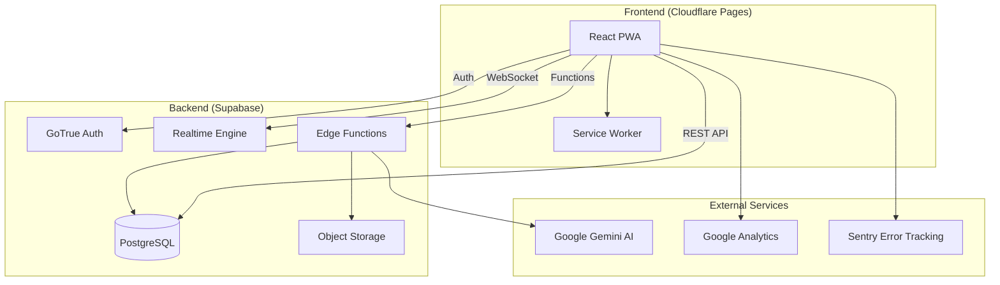
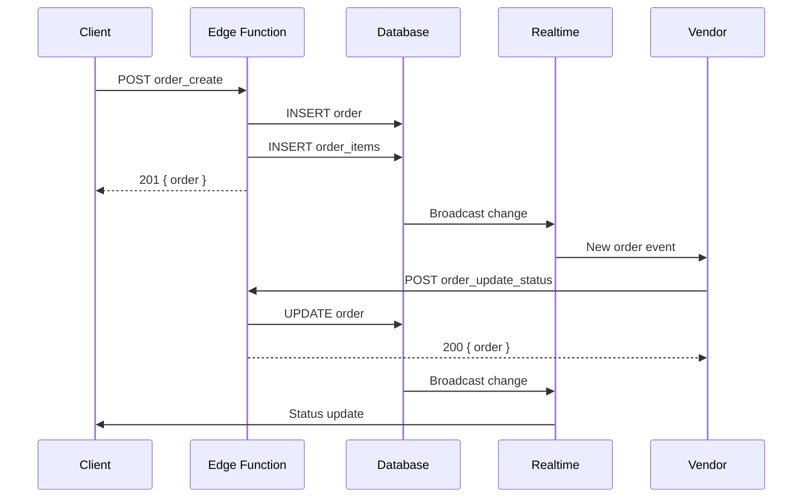
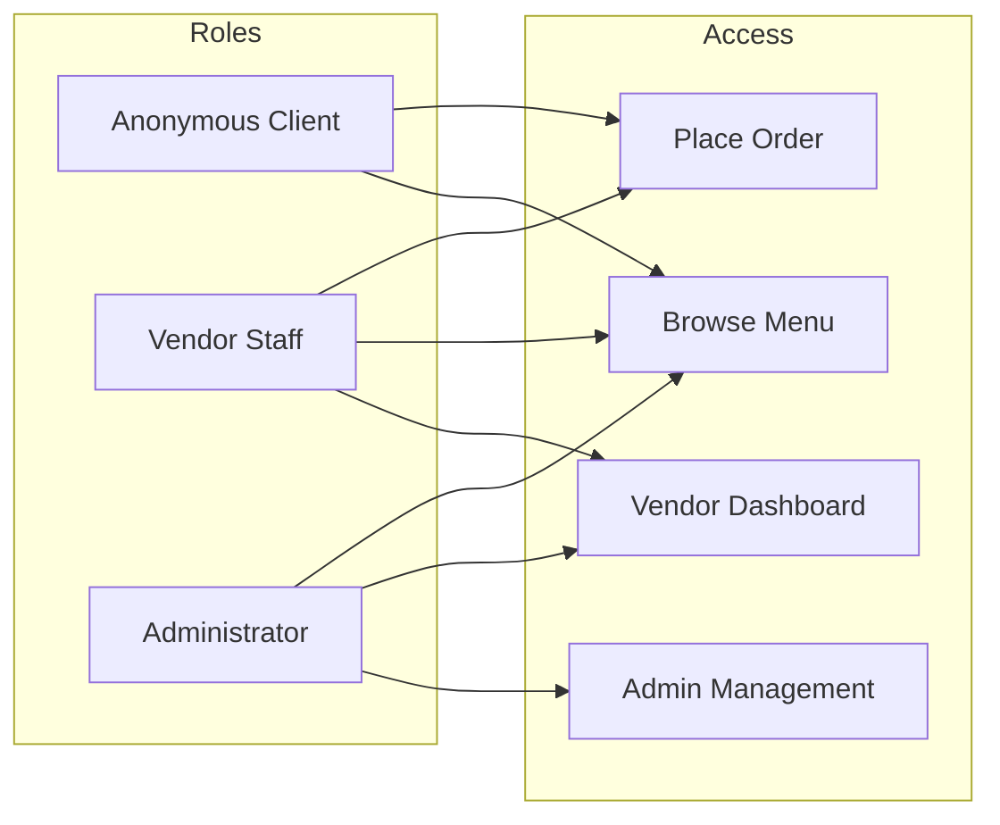

# DineIn Architecture Overview

> System architecture and component diagrams for the DineIn Malta PWA.

---

## System Architecture



---

## Data Flow

### Order Lifecycle



---

## Component Structure

```
apps/web/
├── App.tsx                 # Root component, routing
├── pages/                  # Route components
│   ├── ClientMenu.tsx      # Customer menu view
│   ├── ClientOrderStatus.tsx
│   ├── VendorLogin.tsx
│   ├── vendor/             # Vendor dashboard
│   ├── Admin*.tsx          # Admin portal
│   └── SettingsPage.tsx
├── components/
│   ├── common/             # Shared components
│   ├── menu/               # Menu components
│   ├── ui/                 # Design system
│   └── shared/             # Layout components
├── hooks/                  # React hooks
├── services/               # API & external services
├── context/                # React context providers
└── utils/                  # Utility functions
```

---

## Security Model

### Authentication Layers

| Layer | Implementation | Purpose |
|-------|---------------|---------|
| Frontend | Route guards | UI access control |
| API | Bearer token | Request authentication |
| Database | RLS policies | Row-level security |
| Edge Functions | Auth middleware | Function authorization |

### Role-Based Access



---

## Technology Stack

| Layer | Technology | Purpose |
|-------|------------|---------|
| **Frontend** | React 18 + TypeScript | UI framework |
| **Styling** | Tailwind CSS + Custom Tokens | Design system |
| **Build** | Vite | Development & bundling |
| **State** | React Context + TanStack Query | State management |
| **Backend** | Supabase (Postgres + GoTrue) | BaaS |
| **AI** | Google Gemini | Search & image generation |
| **Hosting** | Cloudflare Pages | CDN + edge hosting |
| **Monitoring** | Sentry + GA4 | Error tracking + analytics |

---

## Database Schema

See [DATABASE_SCHEMA.md](DATABASE_SCHEMA.md) for full table definitions.

Key tables:
- `vendors` - Restaurant/bar profiles
- `menu_items` - Menu entries
- `orders` - Customer orders
- `order_items` - Order line items
- `vendor_users` - Staff accounts
- `admin_users` - Admin accounts
